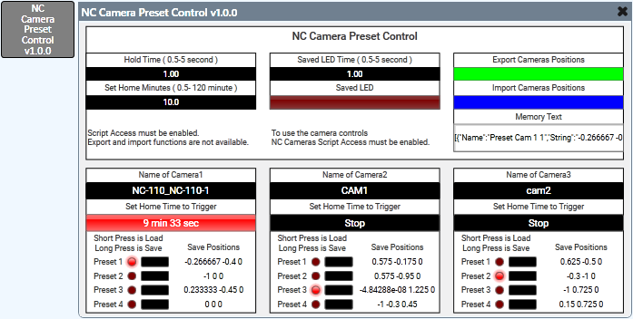

Q-SYS Plugin: Q-SYS NC series preset control plugin.

This plugin is a module for long-press save and short-press load of presets for NC series cameras.
Up to 21 cameras and 30 presets each.
Export and import of memorized positions is also available.
A set home position trigger is also provided.

